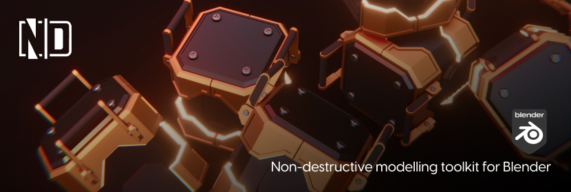

# ***ND (Non-Destructive)***

ND is a Blender add-on that provides workflow enhancements, tools, operations, and generators tailored specifically for non-destructive 3D modelling. It additionally offers post-modelling workflow enhancements for external applications such as Substance Painter, Marmoset Toolbag, game engines, and more.

## Features
- Object and edit mode operations.
- Interactive modifiers.
- Recalling modifiers to alter parameters.
- Streamlined boolean, bevel, extrusion, and replication workflows.
- Model packaging (material IDs, high & low poly, UVs.)
- Scene management (utils, overlays, visualisation modes.)
- Extensive customisation (behaviour, theming, UI.)

    
    

    
    

    
    

    
    

# Documentation

Check out the [written documentation](https://docs.nd.hugemenace.co/) — we're in the process of creating video walkthroughs of the addon & general ND/hard-surface tutorials which will be available soon! Subscribe to our [YouTube channel](https://www.youtube.com/channel/UCS9HsDPcaWQbo-4Brd7Yjmg) so you don't miss anything!

If you encounter a bug, want to send through a feature request, have feedback, or otherwise generally need support, you can get in touch on our [Discord](https://hugemenace.co/discord) server, or via [email](support@hugemenace.co).

# Contributing

1. Start by familiarising yourself with the project (build something cool with it in Blender) and read the [documentation](https://docs.nd.hugemenace.co/).
1. Have a look at the current [issues](https://github.com/hugemenace/nd/issues).
1. If you don't see anything related to your bug fix or enhancement you can [create a new issue](https://github.com/hugemenace/nd/issues/new).
1. The best way to ensure your enhancements make their way into the codebase is to chat about them in [Discord](https://hugemenace.co/discord) to gauge the general appetite of the community / maintainers based on their votes. There is also a special **#contributors** channel where you can discuss your idea further before you begin coding.

# Supporting this project
This addon is free for personal & commercial use (under the [GPLv3 license](LICENSE)). However, if you'd like to support this project financially, consider becoming a HugeMenace Patreon or purchasing this addon from Gumroad, where you can pay what you want 🌿

## License

This project is provided ***free for personal and commercial use*** under the [GPLv3 license](LICENSE) ❤
